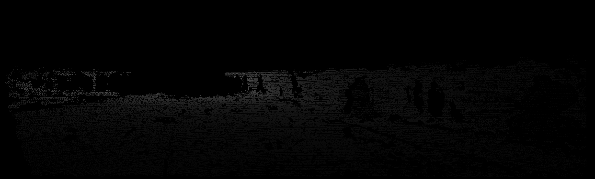

# KITTI-depth

##Visualization based on deep truth data provided by KITTI
 
 
###Just RUN!

##References

* [KITTI](http://www.cvlibs.net/datasets/kitti/eval_depth_all.php)
* [hunse](https://github.com/hunse/kitti)
* [Monodepth2](https://github.com/nianticlabs/monodepth2)

